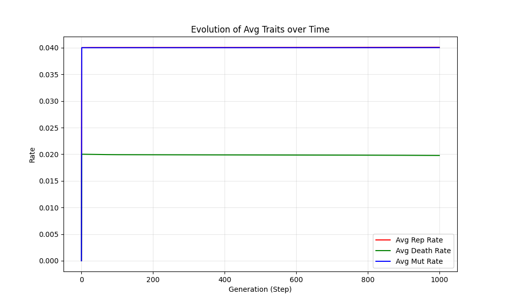

# Selfish Gene Simulation (HPC)

A high-performance, GPU-accelerated stochastic evolutionary simulation inspired by **Richard Dawkins'** book *"The Selfish Gene"* and the **Veritasium** YouTube video on the same topic [here](https://www.youtube.com/watch?v=XX7PdJIGiCw&t=409s). 

This project simulates biological natural selection on a 2D grid, where "selfish" entities evolve traits to maximize their replication and survival in a resource-constrained environment.

## 1. Features & High-Performance Techniques
This simulation is built to leverage the massive parallelism of modern GPUs using several advanced CUDA techniques:

*   **Shared Memory Tiling**: Caches 16x16 cell neighborhoods plus halos in on-chip memory, reducing global memory bandwidth requirements by ~8x.
*   **Stateless Hash-based RNG**: Implements custom injective hash functions (using the PCG/TinyHash approach) to provide unique, high-quality stochasticity per thread without the memory overhead of stateful RNGs like `curandState`.
*   **Stochastic Gather Algorithm**: Employs a "pull-based" stencil strategy where empty cells look for parents, effectively eliminating write-hazards and race conditions in parallel replication.
*   **Vectorized State Kernels**: Uses `float4` memory alignment to process multiple traits (Replication, Death, Mutation) in a single coalesced memory transaction.
*   **Thrust-Parallel Reduction**: Utilizes NVIDIA's Thrust library for ultra-fast population counts and trait summation across the entire grid.

## 2. Simulation Mechanics
The "Selfish Genes" evolve based on three core traits:
*   **Replication Rate ($R$)**: The probability a replicator copies its genome to an adjacent empty spot.
*   **Death Rate ($D$)**: The probability a replicator dies, leaving an empty spot.
*   **Mutation Rate ($M$)**: The probability that traits are randomly perturbed during replication.

**Natural Selection**: Over thousands of generations, species evolve to balance high replication with low mortality. Resource competition is simulated via a **Crowding Cap ($C$)**, which slows down replication as the total population ($N$) grows ($1 - N/C$).

## 3. Visualization




Color represents the genetic identity of each colony:
*   <span style="color:red">**Red**</span>: High Replication Rate
*   <span style="color:green">**Green**</span>: High Survivability (Inverse Death Rate)
*   <span style="color:blue">**Blue**</span>: High Mutation Rate

**Evolutionary Convergence**: Typically, simulations start with sparse noise and evolve into stable **Yellow** (Fast + Hardy) or **Cyan** (Hardy + Mutating) colonies, demonstrating emergent natural selection.


## 4. How to Build & Run

### Prerequisites
*   NVIDIA GPU (Compute 7.5+ recommended)
*   CUDA Toolkit 11.0+
*   CMake 3.18+

### Build
```bash
cmake -B build -S . -DCMAKE_BUILD_TYPE=Release
cmake --build build --config Release
```

### Run Simulation
```bash
# Run with 1024x1024 grid for 1000 steps using the optimized shared-memory kernel
./build/selfish_gene --width=1024 --height=1024 --steps=1000 --crowding=500000 --save-frames --kernel=shared
```

### Generate Video
```bash
# Stitch frames into an MP4 (requires imageio)
python3 scripts/stitch_video.py --output simulation.mp4
```

## Credits
*   **Scientific Inspiration**: Richard Dawkins (*"The Selfish Gene"*)
*   **Conceptual Model**: Veritasium's [YouTube video](https://www.youtube.com/watch?v=XX7PdJIGiCw&t=409s) titled "The Most Controversial Idea in Biology"
*   **Implementation**: Developed as a High-Performance Computing (HPC) case study for CUDA optimization.
